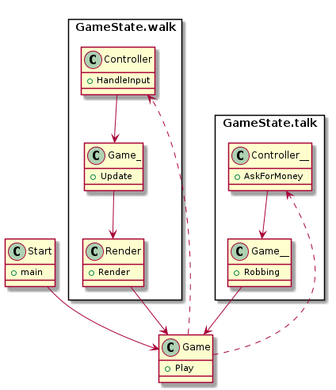

# CPPND: Capstone Robber Game

Capstone project of Laura de Jong in the Udacity C++ Nanodegree Program, build upon the snake starter code of Udaciy in the [Udacity C++ Nanodegree Program](https://www.udacity.com/course/c-plus-plus-nanodegree--nd213). The code for this repo was inspired by [this](https://codereview.stackexchange.com/questions/212296/snake-game-in-c-with-sdl) excellent StackOverflow post and set of responses. [This](https://github.com/udacity/CppND-Capstone-Snake-Game) repo was the starter code for this project.


## Instructions

Clone the project repository:
    ```git clone https://github.com/laurasdejong/CppND-Capstone-Robber-Game.git```

Build the project in REPLACEWITHYOURPATH/CppND-Capstone-Robber-Game: ```make build```

Run the resulting executable in REPLACEWITHYOURPATH/CppND-Capstone-Robber-Game/build: ```./robberGame```

For more info see: https://github.com/udacity/CppND-Capstone-Snake-Game

## Gameplay

The goal of this game is to rob as much gold as possible. The game has two modes. First the robber needs to track its target, after which the game switches to robbing-mode then the robber must decide how much to extort. If the robber asks for more than the target can give, the robber kills the target, and influences future income because of decreased 'town income'(thus, targets wil carry less). However, when the target has the amount the robber asks for, only that amount is transferred to the robber. Each second, the robber has to pay a fee to the 'robbers guild', adding pressure to keep robbing.

The game ends when the robber is bankrupt, or the robber has earned enough to declare himself 'robber king'.

! Bug: The game switches between the terminal and the popup. If the arrows are pressed in the terminal, all future input will be ignored.

## Code structure



## Rubric points

### README
| Criteria       |Intended| Displayed in  |
| ------------- |:---:| ---------------:|
| A README with instructions is included with the project| :ballot_box_with_check: |this |
| The README indicates which project is chosen.| :ballot_box_with_check: |See [Game play](#gameplay) and [Code structure](#code)|
| The README includes information about each rubric point addressed.| :ballot_box_with_check: |this|
### Compiling and Testing
| Criteria       |Intended| Displayed in  |
| ------------- |:---:| ---------------:|
| The submission must compile and run.| :ballot_box_with_check: | See [Instructions](#instructions)|
### Loops, Functions, I/O
| Criteria       |Intended| Displayed in  |
| ------------- |:---:| ---------------:|
| The project demonstrates an understanding of C++ functions and control structures.|:ballot_box_with_check: | For instance, class Game|
| The project reads data from a file and process the data, or the program writes data to a file.|-|-|
| The project accepts user input and processes the input.|:ballot_box_with_check: |Controller::AskForGold|
### Object Oriented Programming
| Criteria       |Intended| Displayed in  |
| ------------- |:---:| ---------------:|
| The project uses Object Oriented Programming techniques.|:ballot_box_with_check:|For instance, class Robber |
| Classes use appropriate access specifiers for class members.|:ballot_box_with_check:| For instance, class Target |
| Class constructors utilize member initialization lists.|:ballot_box_with_check:| For instance, class Target |
| Classes abstract implementation details from their interfaces.| :ballot_box_with_check:| For instance, the gold of Target |
| Classes encapsulate behavior.|:ballot_box_with_check:|For instance, class Target|
| Classes follow an appropriate inheritance hierarchy.| | |
| Overloaded functions allow the same function to operate on different parameters.| :ballot_box_with_check:|Robber::AskedAmount |
| Derived class functions override virtual base class functions.|-|-|
| Templates generalize functions in the project.|-|-|
### Memory Management
| Criteria       |Intended| Displayed in  |
| ------------- |:---:| ---------------:|
| The project makes use of references in function declarations.| | |
| The project uses destructors appropriately.|-|-|
| The project uses scope / Resource Acquisition Is Initialization (RAII) where appropriate.| | |
| The project follows the Rule of 5.|-|-|
| The project uses move semantics to move data, instead of copying it, where possible.| | |
| The project uses smart pointers instead of raw pointers.| | |
### Concurrency
| Criteria       |Intended| Displayed in  |
| ------------- |:---:| ---------------:|
| The project uses multithreading.|-|-|
| A promise and future is used in the project.|-|-|
| A mutex or lock is used in the project.|-|-|
| A condition variable is used in the project.|-|-|
